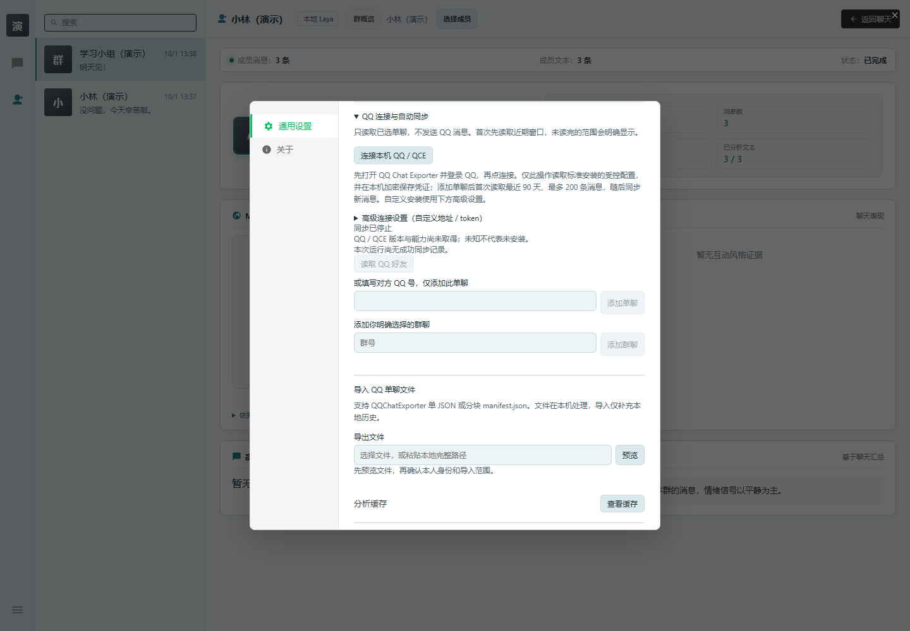
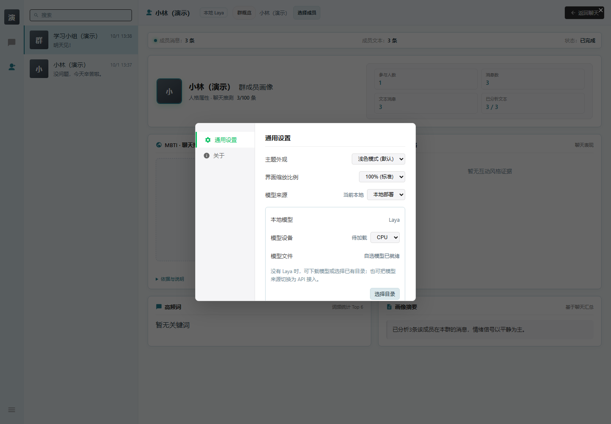
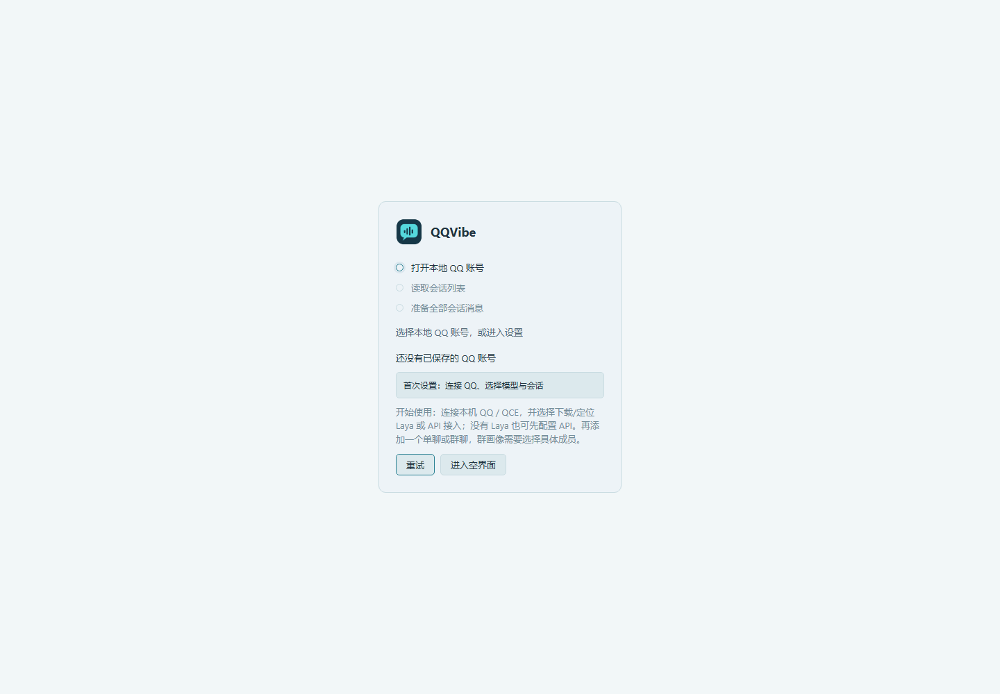

# QQVibe 首次使用说明

这份说明面向第一次使用 QQVibe 的人。完成后，你可以在 QQVibe 中打开自己的一个单聊或群聊，并查看本地分析结果。不需要会编程。程序旁的 **「使用说明.html」**也可直接打开，离线查看图文步骤。

## 1. 下载正确的程序包

点击 **[下载 QQVibe 0.1.1 Windows 完整包](https://github.com/xzyj50609/QQVibe/releases/download/v0.1.1/QQVibe-0.1.1-windows-x64-full.zip)**。如果不能直接下载，打开[下载页面](https://github.com/xzyj50609/QQVibe/releases/tag/v0.1.1)，在下方的 **Assets**（文件列表）里点击：

**QQVibe-0.1.1-windows-x64-full.zip**

这个文件包含程序和 Laya 模型，第一次使用优先选它。**不要下载「Source code」或点击绿色「Code」按钮**，那些是给开发者的源码。公开下载不需要注册 GitHub 账号。

目前提供 Windows x64 程序，推荐先在 Windows 11 上使用。Windows 10、其他电脑与更多硬件的实际情况见[兼容表](COMPATIBILITY.md)。

## 2. 解压并打开

1. 下载完成后，在 ZIP 文件上点右键，选择「全部解压缩」，或使用你平时的解压软件。
2. 解压到自己可以保存文件的普通目录，例如 `D:\Apps\QQVibe`；没有 D 盘也可以放在自己的「文档」文件夹。不要放在压缩包内或系统的「Program Files」目录。
3. 打开解压后的文件夹，再打开 **win-unpacked**。
4. 双击 **QQVibe.exe**。

QQVibe 是便携程序，数据保存在解压目录内。以后移动程序时请一起保留整个文件夹，升级前先做备份。新用户默认浅色；如果从旧版恢复了深色设置，可在设置的 **「主题外观」**中选择 **「浅色模式」**。

应用目前未签名，Windows 可能显示安全提示。先确认下载来自上述仓库；不确定时把提示文字发给提供软件的同学，不要为此关闭安全软件。下载页提供 SHA256 校验文件，熟悉校验的人可以用它核对 ZIP。

## 3. 安装并登录 QCE

QCE 的全名是 **QQ Chat Exporter**。它负责在你的电脑上连接 QQ，QQVibe 再从它读取你选择的聊天。它是单独安装的软件，不在 QQVibe ZIP 里。

1. 打开 [QCE 6.3.0 官方下载页面](https://github.com/shuakami/qq-chat-exporter/releases/tag/v6.3.0)。
2. 在 **Assets** 文件列表中下载 **QQChatExporter-Installer-v6.3.0.exe**，这是 Windows x64 的一键安装包。
3. 双击安装文件，跟着它的向导安装并启动。
4. 在 QCE 中用**自己的 QQ**扫码或快捷登录。
5. 确认 QCE 显示的是自己的账号，能看到会话列表，然后保持 QCE 运行。

如果 QCE 提示在浏览器打开界面，使用它给出的本机入口；默认通常是 [http://localhost:40653/qce](http://localhost:40653/qce)。这个地址只有准备好 QCE 的那台电脑可以使用。

本说明固定使用 6.3.0，方便定位问题。QQ 与 QCE 的变化可能影响连接；若安装或登录失败，记录版本和提示，不要盲目反复更换 QQ 版本。

我已经用过 QCE 或 NapCat，想沿用自己的安装

已有桌面 QQ 并使用 Framework 模式的人，可以从同一官方发布页下载 **NapCat-Framework-QCE-v6.3.0.zip**，完整解压，完全退出 QQ 后运行 **napiLoader.bat**，再登录自己的 QQ。这与上方的一键安装二选一，不要求先安装 LiteLoader。

自定义安装目录、端口或访问 token 的连接方式见本文末尾「高级连接」。standalone 的离线浏览模式不能提供在线新消息。如果不熟悉这些名称，使用上方的一键安装路线即可。

## 4. 在 QQVibe 中连接自己的 QQ

1. 回到 QQVibe，点击 **「首次设置：连接 QQ、选择模型与会话」**。
2. 在 **「QQ 连接与自动同步」**中点击 **「连接本机 QQ / QCE」**。
3. 等待连接状态更新，核对显示的是自己的账号。
4. 如果提示 QCE 没有运行或没有登录，回到 QCE 完成上一步，再重试。

标准安装由程序寻找受控配置，不需要你翻日志找 token。没有连接成功前，不必填写好友或群号。

*演示数据，分析内容仅作界面展示；截图未连接真实 QCE，不表示连接已通过。*

## 5. 选择本地 Laya / CPU

在设置中找到模型区域：

1. **「模型来源」**选择 **「本地部署」**。
2. **「模型设备」**选择 **「CPU」**。
3. 查看 **「模型文件」**与设备状态，等待模型就绪。
4. 如果出现 **「启用本地模型」**按钮，点击它。

Laya 是用于分析文字的本地模型。完整包已经带有它，一般不需要再下载。先选 CPU，走通第一次使用后再考虑 GPU；目前只有开发机的 Intel UHD WebGPU 有实测，其他显卡仍在验证。

*演示数据，分析内容仅作界面展示；模型文件提示与运行时是否就绪应分别看，截图不代表完成真实推理。*

如果提示缺少模型，先检查自己是否下载了文件名带 **-full.zip** 的完整包，以及是否完整解压。你也可以按下方「无模型标准包」的步骤准备模型，界面和 API 设置仍然可以打开。

## 6. 添加一个单聊或群聊

第一次先添加一个你有权读取的聊天，不要一开始就添加很多会话。

**添加单聊：**

1. 在 **「QQ 连接与自动同步」**中点 **「读取 QQ 好友」**，找到要查看的好友并添加。
2. 也可以在 **「或填写对方 QQ 号，仅添加此单聊」**下面填写对方 QQ 号，点 **「添加单聊」**。
3. 关闭设置，在左侧会话列表打开这个聊天。

**添加群聊：**

1. 在 QQ 中查看这个群的群号。
2. 在 **「添加你明确选择的群聊」**下填写群号，点 **「添加群聊」**。
3. 关闭设置，在左侧会话列表打开这个群。

首次添加会话会有范围限制，默认读取最近 90 天、最多 200 条记录；实际已读范围和历史缺口以页面提示为准。这不等于 QQ 的全部历史记录。

## 7. 查看分析，完成第一次使用

打开会话后，消息可以先浏览，分析结果会逐步出现。确认下方的 **「情绪 / 意图」**已开启；需要查看画像时点 **「人物画像」**。

- **单聊：**在画像页面切换 **「我」**和 **「对方」**，分别查看双方在这个单聊中的交流情况。
- **群聊：**先看 **「群概览」**，再点 **「选择成员」**查看具体成员在这个群里的画像。

群聊标签是实验候选，可能误读引用、讽刺或多人对话。百分比不是准确率；画像也不是对人的定论。显示「样本不足」「待判断」时，不代表程序损坏。

接下来可以按[使用手册](USER-GUIDE.md)了解搜索和分析控制，按[第一次试用清单](R9-TRIAL.md)记录这台电脑的结果。第一次走通后，在设置的 **「完整数据备份与恢复」**中做一份备份。

## 无模型标准包：下载或选择模型

如果你已经有模型，或希望自己配置服务，可以下载[标准程序包](https://github.com/xzyj50609/QQVibe/releases/download/v0.1.1/QQVibe-0.1.1-windows-x64.zip)。它不含 Laya 模型，程序本身仍可启动。

- 在「本地部署」下点 **「下载模型」**，等待下载与检查完成。下载失败可以重试，不会妨碍进入 API 设置。
- 已有完整 Laya 文件夹时点 **「选择目录」**，选择包含 `model.onnx` 的目录；不要只选其中一个文件。选定的外部模型目录以后也要保留。

*演示数据，分析内容仅作界面展示；此图使用空目录，没有真实账号和模型。*

自动下载不可用时，如何手动准备固定版本模型

程序使用[固定上游模型 ZIP](https://github.com/tswawa/WechatVibe/releases/download/v1.2.0/WechatVibe-Laya-model-v1.zip)，约 599 MB，SHA256：

`abdd8bc363726e40a94e77750d09828cd681e08876e13c9be6ef776a3a24c4af`

这是模型文件来源，不是 QQVibe 的应用更新源。自动下载不可达时，可以从[固定 ONNX 版本](https://huggingface.co/mizchi/laya-multilingual-onnx/tree/d9d003d543e63d6d3375c21d44624136bd1e0bad)获取：

- `model.onnx`
- `onnx_config.json`
- `rl_agent_config.json`
- `README.md`
- `tokenizer/tokenizer.json`
- `tokenizer/tokenizer_config.json`

保留 `tokenizer` 子目录，再在 QQVibe 点「选择目录」。请使用这组固定版本文件，不要混用其他模型或随意替换文件。程序会检查所需文件，许可来源见[模型说明](MODEL-LICENSE.md)。

## 可选：使用 API 或 Ollama

第一次使用推荐本地 Laya / CPU。如果你已经有自己的模型服务，可以在 **「模型来源」**中切换到 **「API 接入」**，无需下载 Laya。

1. 选择服务对应的 **「接口协议」**。
2. 按服务商说明填写 **Base URL** 和自己的 **API Key**。
3. 点 **「获取模型列表」**后选择模型，或手动填写 **「模型 ID」**。
4. 填写该服务支持的 **「上下文大小」**。
5. 点 **「测试连接」**，再点 **「保存并启用」**。

Chat Completions 对应界面中的 **「Completions（旧版）」**。Ollama 使用 **「Ollama 兼容」**，先自行启动本地 Ollama 并准备模型；常用本机地址为 `http://127.0.0.1:11434`。

真实 API/Ollama 服务尚未完成验证；目前的本机假服务检查只证明界面和流程，不证明你的服务能完成分析。API 模式会把需要分析的聊天片段发送给你填写的服务，可能产生费用。编程助手订阅不等于这个服务的额度；暂停前已经发出的请求仍可能计费。不要把 Key 发给同学或写在反馈里。

## 高级连接：自定义 QCE 安装

仅自定义安装目录或端口时使用。在 **「QQ 连接与自动同步」**中展开 **「高级连接设置（自定义地址 / token）」**，填写自己的 QCE 本机地址、本人 QQ 号和访问 token，点 **「保存连接」**，再点 **「连接并同步」**。

这些值只用于自己的电脑；不要使用别人的配置，也不要发送 token。若不确定配置在哪里，先把安装方式和错误提示反馈给提供软件的同学。

遇到卡点请看[已知问题](KNOWN-ISSUES.md)，反馈方法见[反馈模板](FEEDBACK.md)。
