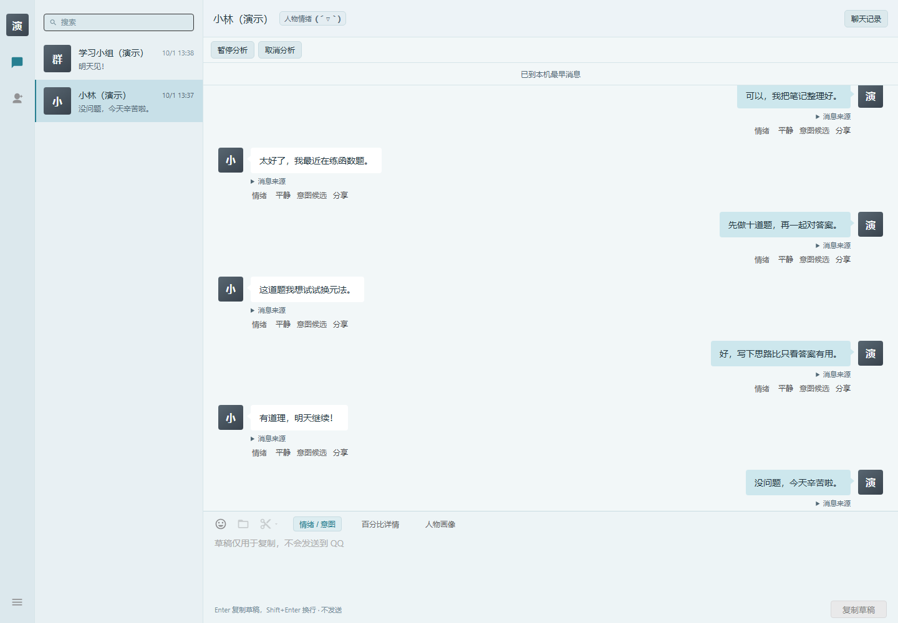
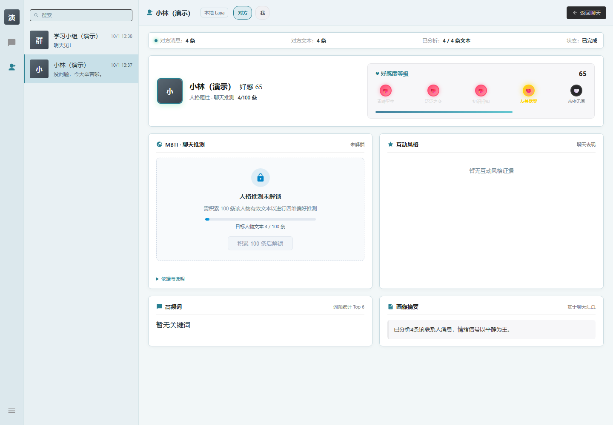
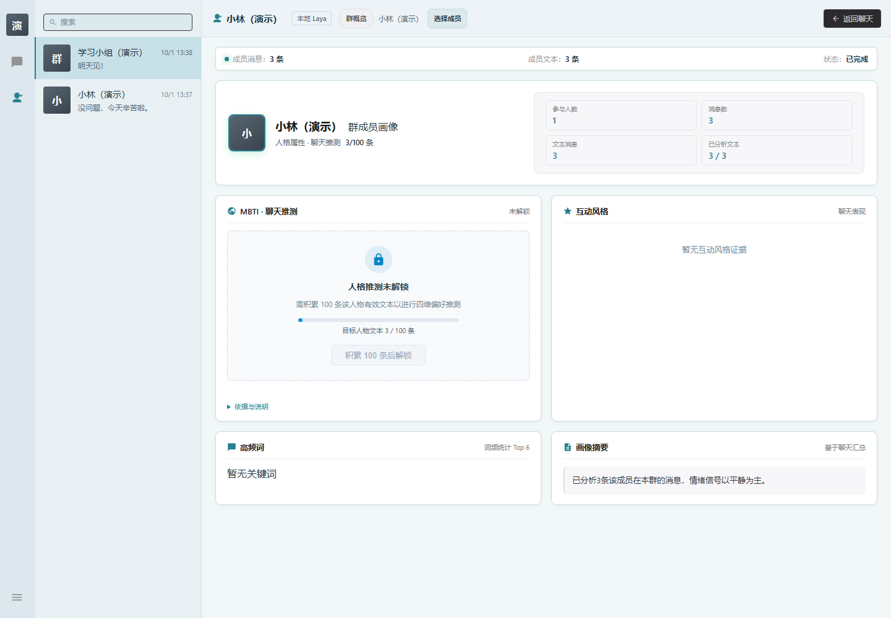
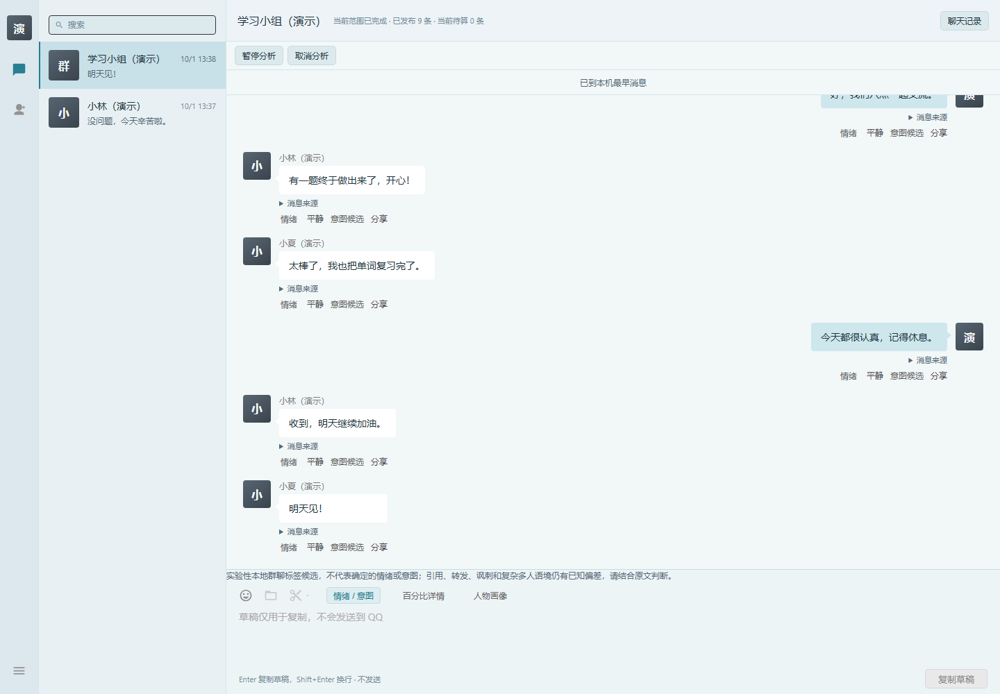

# QQVibe 使用手册

QQVibe 用来回顾自己选择的 QQ 单聊和群聊。它把原始消息、模型标签与人物画像放在同一应用里，方便你回看交流、查找上下文。第一次安装和连接请先看[首次使用说明](SETUP.md)。解压目录的 **「使用说明.html」**可在浏览器中离线打开。

本文和截图中的账号、昵称与聊天都是演示资料，分析内容仅作界面展示。

## 认识主界面

*演示数据，分析内容仅作界面展示。*

- **会话列表：**切换已经添加的单聊或群聊。
- **消息区域：**阅读消息原文、时间与发言人，查看已经生成的分析标签。
- **「聊天记录」：**搜索关键词、日期，群聊还可以筛选成员。
- **「情绪 / 意图」与「人物画像」：**查看消息标签，或切换到当前会话的画像页面。
- **设置：**连接 QQ、选择模型、管理会话和账号、备份与恢复。

QQVibe 新用户默认使用浅色界面。恢复旧版设置后仍为深色时，在 **「主题外观」**中选择 **「浅色模式」**即可。字太小可在设置中调整 **「界面缩放比例」**。

## 看单聊

*演示数据，分析内容仅作界面展示。*

1. 在左侧会话列表打开一个单聊。
2. 先核对对方昵称和消息中的身份归属，确认「我」没有被当成对方。
3. 保持 **「情绪 / 意图」**开启，查看消息旁的分析标签。第一次分析需要等待，已有消息可以继续阅读。
4. 想看模型分数时点 **「百分比详情」**；想恢复简洁显示时点 **「切回简洁」**。
5. 点 **「人物画像」**，在页面上切换 **「我」**和 **「对方」**，查看双方分别在这个单聊里的画像。
6. 点 **「返回聊天」**回到消息。

标签和画像是模型对这段聊天的推测。分数高不等于判断一定正确；人物画像也不是心理测评。样本不足时会显示「待判断」或尚未解锁，继续积累足够文本后再看。

## 看群聊

*演示数据，分析内容仅作界面展示。*

1. 打开已经添加的群，核对群名、发言人和群名片。
2. 阅读消息时结合上下文看标签。**本地群聊标签目前是实验候选**，引用、转发、讽刺和多人对话可能被误读。
3. 点 **「人物画像」**，先看 **「群概览」**。这里的消息数、文本数和参与人数对应已读取范围，不是全群全部历史。
4. 点 **「选择成员」**，搜索并选择一位具体成员，查看他在这个群里的画像。
5. 换成员时核对当前成员名称。群画像只来自此人在这个群里的发言，不会把其他所有人拼成一个「对方」。

成员列表中没有某个人时，可能是当前已读范围里没有他的发言，不代表他不在 QQ 群内。

*演示数据，分析内容仅作界面展示；图中的标签不代表已完成语义质量验证。*

## 搜索旧消息

1. 在会话右上方点 **「聊天记录」**。
2. 输入关键词，按需要选择日期；群聊可以选择成员。
3. 点 **「搜索」**，打开某条结果查看它前后的消息。
4. 需要继续往前看时点 **「加载更早」**。
5. 看完后点 **「返回最新」**回到当前消息。

搜索的是 QQVibe 已读取或导入的记录。没有搜索到，可能是当前范围还没有这段消息；请查看设置中的 **「当前会话的数据范围与管理」**，不要把搜索不到当作 QQ 原记录已被删除。

## 添加和管理会话

在线会话通过设置的 **「QQ 连接与自动同步」**添加：

- 点 **「读取 QQ 好友」**选择好友，或填写对方 QQ 号点 **「添加单聊」**。
- 填写自己选择的群号，点 **「添加群聊」**。

在设置的 **「信息列表 → 管理会话」**中，可以把已保存会话加入左侧列表，或从列表移除。**「从列表移除」**只是调整显示；清理已读消息需要使用专门的本地副本管理入口。

首次添加默认有最近 90 天、最多 200 条的读取边界。页面若提示未读完、缺口或部分范围，就按当前范围理解统计。QQVibe 不承诺取得 QQ 所有漫游历史。

## 新消息、暂停和取消

保持 QCE 登录、QQVibe 正常运行，并启用对应会话的读取后，程序会同步已选会话的新消息。分析与读取分别进行，模型慢时仍然可以先阅读。

| 操作 | 会发生什么 |
| --- | --- |
| 「暂停分析」 | 保留尚未完成的分析范围，已完成结果保留，消息读取与浏览继续 |
| 「继续分析」 | 继续处理暂停后尚未完成的范围 |
| 「取消分析」 | 取消尚未完成的范围，已完成标签保留 |
| 设置中的「停止读取此会话」 | 停止这个会话后续读取，已有本地记录仍可查看 |

API 模式下，暂停或取消前已经发给服务商的请求可能继续结束，也可能计费。界面中的请求上限控制接下来允许发出的次数，不替代服务商自己的费用预算；没有费率时只显示次数。

如果连接中断，先确认 QCE 仍然运行、账号仍已登录，再回到设置重连。不要在身份不确定时反复添加会话。

## 关闭和重新打开

1. 正常退出 QQVibe。
2. 下次从同一个解压目录打开 **QQVibe.exe**。
3. 如出现已保存账号入口，选择自己的账号查看记录。
4. 已保存消息和分析结果可以离线浏览；需要继续同步时重新确认 QQ/QCE 连接。

请保留原解压目录。解压到新文件夹相当于使用另一份便携程序，不会自动从旧目录读取数据。

## 备份、升级和恢复

第一次使用成功后，以及更新前，在设置的 **「完整数据备份与恢复」**中点 **「备份全部数据」**，把备份保存到自己的目录。

备份包含聊天和账号配置，属于私人资料，不要随反馈上传。模型文件不包含在备份内；自行选择的外部模型文件夹也需要另行保留。

升级时先保留旧程序，**把新版解压到另一个目录**，再通过 **「恢复备份」**导入旧备份。不要直接覆盖运行中的程序。恢复后核对账号、会话、消息与结果，再重新连接；换电脑或 Windows 账号后需要重新配置凭证。

详细步骤见[备份、升级与回退](BACKUP-UPGRADE.md)。跨机恢复仍在验证，旧目录和原备份应保留到新版确认可用。

## 导入已有 QCE 文件

0.1.2 支持更多 JSON 列表结构、字段映射和大文件分批读取。具体用法见 [JSON 导入说明](JSON-IMPORT.md)。

已有 QCE 导出记录时，可在设置中选择导出文件，确认「哪一个 QQ 号是本人」，查看预览后再确认导入。支持的入口包括 QCE 单 JSON 与分块 manifest 文件，具体会话类型以导入预览为准。

导入是在本机补充历史，不代表已经连接在线 QQ；要同步自然新增的消息，仍需正常登录 QCE 并连接。

## 删除自己的本地副本

在设置的 **「当前会话的数据范围与管理」**中使用 **「清除此会话副本」**。清除前按提示保留备份，核对会话后再确认。它清除的是 QQVibe 本地消息和分析副本，不删除 QQ 原始记录。

账号级清理通过 **「查看账号」**内的管理入口进行。不要靠手工删除数据库文件解决连接或分析问题。

## 遇到问题时

先查看[已知问题](KNOWN-ISSUES.md)和[兼容表](COMPATIBILITY.md)。仍无法解决时：

1. 记录版本和最后失败的步骤。
2. 到设置的 **「关于 QQVibe」**中点 **「导出诊断信息」**。
3. 打开诊断文件自行检查后，将匿名诊断与错误提示发给提供软件的同学，或按[反馈模板](FEEDBACK.md)提交。

诊断用于记录版本、状态与计数，不需要聊天正文、账号标识或密钥。截图必须遮住账号、昵称、头像、群名和消息原文。不要上传数据库或完整备份。

第一次在另一台电脑使用时，可直接填写[一页试用清单](R9-TRIAL.md)，未尝试的项目留为「没试」即可。
